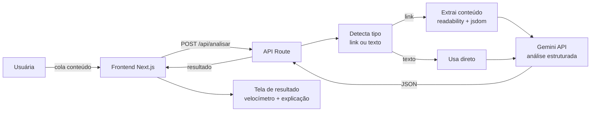

# Verificaki

> Plataforma livre, anônima e gratuita para checagem de notícias e acesso a dados públicos sobre representantes políticos. Construída para o **2º Hackathon da Mobilização Popular** (UEE-SP, junho de 2026).

[](LICENSE)
[](https://www.gnu.org/philosophy/free-sw.pt-br.html)

🔗 **Demo:** *(URL será adicionada após o deploy)*
📅 **Hackathon:** 20 de junho de 2026 · UEE-SP · Centro Cultural Vergueiro
🏛️ **Tema:** Como a tecnologia pode fortalecer a busca por transparência na rede?

---

## O problema

A desinformação se espalha mais rápido do que a checagem. Pessoas comuns
recebem links, vídeos cortados, fotos descontextualizadas e dados sobre
políticos no WhatsApp, no TikTok, no Facebook — e não têm tempo, ferramenta
ou conhecimento técnico para verificar se aquilo é verdade.

As ferramentas de checagem existentes geralmente são:
- pagas ou exigem login;
- escondidas em sites pouco amigáveis;
- pensadas para jornalistas, não para a população em geral;
- coletoras de dados pessoais — o que afasta quem mais precisa.

## A solução

Uma plataforma web única, com **um campo inteligente** onde a usuária cola
qualquer coisa — link de notícia, texto, link de vídeo ou imagem — e recebe
uma análise em linguagem simples sobre a credibilidade do conteúdo.

**Princípios:**
- 🆓 **Gratuita e anônima** — sem cadastro, sem cookies, sem armazenamento.
- 📱 **Acessível** — funciona em conexões lentas e celulares antigos.
- 🗣️ **Linguagem simples** — sem jargão técnico nos resultados.
- 🔓 **Software livre** — código aberto, qualquer organização popular pode adaptar.
- 🛡️ **Sem coleta de dados** — a chave da API fica no backend, nada é guardado.

---

## Funcionalidades

### MVP (versão atual)
- ✅ **Detector de Fake News** — análise de credibilidade de notícias (link ou texto) com índice visual de 0 a 100%, categoria colorida e explicação simplificada.

### Em construção / próximas versões
- 🚧 **Raio-X do Político** — consolida projetos de lei, votações e gastos públicos de qualquer parlamentar, com resumo em IA.
- 🚧 **Desmentidor de Cortes** — analisa vídeos de redes sociais e busca o contexto original.
- 🚧 **Análise de Imagem** — descreve imagens e aponta elementos suspeitos.

---

## Como funciona (arquitetura)



---

## Stack técnica

| Camada | Tecnologia |
|---|---|
| Frontend | Next.js 14 (App Router) + React + Tailwind CSS |
| Backend | API Routes do Next.js (Node.js) |
| IA | Google Gemini API (`gemini-2.5-flash`, free tier sem cartão de crédito) |
| Extração de conteúdo | `@mozilla/readability` + `jsdom` |
| Deploy | Vercel |
| Controle de versão | Git + GitHub (Conventional Commits) |
| Licença | AGPL-3.0 |

---

## Como rodar localmente

### Pré-requisitos

- Node.js 20+ ([baixar](https://nodejs.org))
- Conta Google + chave de API gerada no [Google AI Studio](https://aistudio.google.com/app/apikey) (gratuita, sem cartão)

### Passo a passo

```bash
# 1. Clonar o repositório
git clone https://github.com/cb-hackathon/CMD-Verificaki.git
cd CMD-Verificaki

# 2. Instalar dependências
npm install

# 3. Configurar variáveis de ambiente
cp .env.example .env.local
# Editar .env.local e colocar sua DEEPSEEK_API_KEY

# 4. Rodar em modo desenvolvimento
npm run dev

# 5. Abrir no navegador
# http://localhost:3000
```

### Variáveis de ambiente

```bash
# .env.local
GEMINI_API_KEY=AIza...  # Obrigatória — chave da API do Google Gemini
```

**⚠️ Atenção:** a chave da API **nunca** deve ir para o frontend ou para o repositório. O arquivo `.env.local` já vem no `.gitignore` do Next.js.

---

## Estrutura do projeto

```
.
├── app/
│   ├── page.tsx               # Home (campo único de entrada)
│   ├── resultado/             # Tela de resultado da análise
│   ├── erro/                  # Tela de erro unificada
│   └── api/
│       └── analisar/          # Endpoint principal de análise
├── lib/
│   ├── gemini.ts            # Cliente da API Gemini
│   ├── extrair-conteudo.ts    # Parser de links de notícias
│   ├── detectar-tipo.ts       # Identifica link vs texto
│   └── rate-limit.ts          # Limite de 15 análises/dia por IP
├── components/                # Componentes React reutilizáveis
├── public/                    # Assets estáticos
└── README.md
```

---

## Como contribuir

Este é um projeto de software livre criado em um hackathon de mobilização
popular. Contribuições são MUITO bem-vindas, especialmente de:

- Organizações populares que querem adaptar para suas pautas
- Desenvolvedoras e desenvolvedores comprometidos com transparência
- Pessoas com domínio em desinformação, comunicação política, acessibilidade

**Fluxo:** abra uma issue antes de mexer em algo grande, faça fork, mande PR
com descrição clara. Seguimos [Conventional Commits](https://www.conventionalcommits.org/pt-br/).

---

## Equipe

| Pessoa | Papel |
|---|---|
| **Amanda** | Integrações (Gemini, parser de conteúdo) |
| **Yasmin** | Backend (API Routes, rate limiting, orquestração) |
| **Thuane** | Frontend (UI, design system, acessibilidade) |

---

## Limitações conhecidas (transparência radical)

- Esta plataforma usa IA para **apoiar** a análise crítica, **não substitui** o jornalismo investigativo nem a checagem profissional de fatos.
- A análise pode errar. O resultado mostra **sinais de credibilidade**, não veredito de verdade absoluta.
- O limite de 15 análises por dia por IP existe para garantir gratuidade — não há plano pago, nem nunca haverá.
- Não armazenamos resultados. Se você quer compartilhar uma análise, copie o texto.
- Em conexões muito ruins, o tempo de resposta da IA pode passar de 10s. Estamos otimizando.

---

## Licença

Este projeto está sob a [GNU Affero General Public License v3.0](LICENSE).

Isso significa que você pode usar, modificar e redistribuir o código
livremente, **desde que** qualquer versão modificada também seja distribuída
sob a mesma licença, mesmo se for usada apenas em um servidor web. Essa
escolha protege o projeto de ser fechado por terceiros.

---

## Agradecimentos

- À **UEE-SP** e ao **Centro de Estudos da Mídia Alternativa Barão de Itararé** pela organização do hackathon.
- À comunidade de **software livre brasileira** pelas ferramentas que tornaram este projeto possível.
- A todas as organizações populares que mantêm viva a luta por uma internet democrática.

---

*Construído com 💚 em um final de semana de junho, com 5 horas no relógio e 3 desenvolvedoras determinadas a entregar algo que pudesse, de fato, servir à mobilização popular.*
